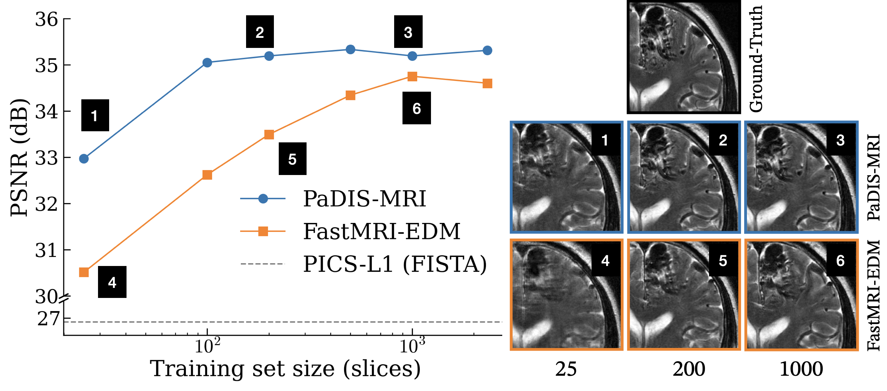

## PaDIS-MRI: Patch-Based Diffusion for Data-Efficient, Radiologist-Preferred MRI Reconstruction<br>



**PaDIS-MRI: Patch-Based Diffusion for Data-Efficient, Radiologist-Preferred MRI Reconstruction**<br>
Rohan Sanda, Asad Aali, Andrew Johnston, Eduardo Reis, Jonathan Singh, Gordon Wetzstein, Sara Fridovich-Keil
<br>[https://www.arxiv.org/abs/2509.21531](https://www.arxiv.org/abs/2509.21531)<br>

*Magnetic resonance imaging (MRI) requires long acquisition times, raising costs, reducing accessibility, and making scans more susceptible to motion artifacts. Diffusion probabilistic models that learn data-driven priors can potentially assist in reducing acquisition time. However, they typically require large training datasets that can be prohibitively expensive to collect. Patch-based diffusion models have shown promise in learning effective data-driven priors over small real-valued datasets, but have not yet demonstrated clinical value in MRI. We extend the Patch-based Diffusion Inverse Solver (PaDIS) to complex-valued, multi-coil MRI reconstruction, and compare it against a state-of-the-art whole-image diffusion baseline (FastMRI-EDM) for undersampled MRI reconstruction on the FastMRI brain dataset. We show that PaDIS-MRI models trained on small datasets of as few as 25 k-space images outperform FastMRI-EDM on image quality metrics (PSNR, SSIM, NRMSE), pixel-level uncertainty, cross-contrast generalization, and robustness to severe k-space undersampling. In a blinded study with three radiologists, PaDIS-MRI reconstructions were chosen as diagnostically superior in 91.7% of cases, compared to baselines (i) FastMRI-EDM and (ii) classical convex reconstruction with wavelet sparsity. These findings highlight the potential of patch-based diffusion priors for high‐fidelity MRI reconstruction in data‐scarce clinical settings where diagnostic confidence matters.*


### Requirements
* Python libraries: See [environment.yml](./environment.yml) for exact library dependencies.
* Also see [BART Installation Guide](https://mrirecon.github.io/bart/installation.html) for help on installing the BART (Berkeley Advanced Reconstruction Toolbox) package for MRI reconstruction tools.

### Initial Setup
1. Create conda environment: 
```bash
conda env create -f environment.yml
conda activate padis-mri
```
2. Set path to BART environment in [util.py](./dnnlib/util.py). 

### Preparing datasets
1. Create a data directory: 
```bash
mkdir /data/datasets/fastmri
```
2. Begin by downloading the brain, multicoil training and validation datasets from the [NYU Langone Health fastMRI Dataset](https://fastmri.med.nyu.edu/) to the above directory. In this work, we use *brain_multicoil_train_batch_9* and *brain_multicoil_val_batch_1*. 
3. Unzip the files to get sets of training and validation ```.h5``` files in ```multicoil_train``` and ```multicoil_val```, respectively. 
4. Run the following commands from ROOT to generate a training dataset of particular size. The example command below will generate a dataset of 200 slices (1 slice from each of 200 randomly sampled volumes (containing a mix of contrast types) in the ```multicoil_train``` directory). 
  - Training: 
  ```bash
  python data/brain_train_data.py --h5_folder /data/datasets/fastmri/multicoil_train --num_slices 1 --output_root /data/datasets/fastmri --max_volumes 200
  ```
  This will generate a training set directory ```/data/datasets/fastmri/brain_train_d200/32dB``` containing your data. 

  - Validation: 
  To generate a validation set, you must first process the validation ```.h5``` files and then subsample them to create T2 and T1+FLAIR evaluation sets. 
    - First run the following to generate the T2 evaluation dataset:
    ```bash
    python data/brain_val_data.py --h5_folder /data/datasets/fastmri/multicoil_val  --output_root /data/datasets/fastmri --contrast t2
    ```
    This will create the t2 evaluation set at ```/data/datasets/fastmri/val_t2/32dB```.

    - Then run the following to process the remaining T1+FLAIR volumes:
      ```bash
      python data/brain_val_data.py --h5_folder /data/datasets/fastmri/multicoil_val  --output_root /data/datasets/fastmri --contrast t1-flair
      ```

    This will create the t1-flair evaluation set at ```/data/datasets/fastmri/val_t1-flair/32dB```.
  
    - Finally, run the following command to subsample 32 T1+FLAIR samples (25 T1 and 7 FLAIR) to use in the evaluation set. 
      ```bash
      python data/subsample_val_by_contrast.py --i /data/datasets/fastmri/val_t1-flair/32dB -o /data2/rohan/val_t1-flair_subsamp
      ```
      This will create the subsampled t1-flair evaluation set at ```/data/datasets/fastmri/val_t1-flair_subsamp/32dB```.

  
  Three datasets have now been generated:
  - Training (200 slices): ```/data/datasets/fastmri/brain_train_d200/32dB``` 
  - Evaluation:
    - T2 (50 T2 that are subsampled in the eval script directly): ```/data/datasets/fastmri/val_t2/32dB```
    - T1 (25 T1, 7 FLAIR): ```/data/datasets/fastmri/val_t1-flair_subsamp/32dB```

### Train Patch Diffusion
To train PaDIS-MRI or FastMRI-EDM from scratch, modify the shell scripts [train_padis.sh](./bash/train_padis.sh) or [train_edm.sh](./bash/train_edm.sh) with your data and output paths as well as desired hyperparameters. The default settings are those used in our paper. 

From ROOT, run:
```bash
bash bash/train_padis.sh
```

```bash
bash bash/train_edm.sh
```

[Wandb](https://wandb.ai/) can be used to track progress. Please see the relevant training scripts ([fastmri-train.py](./train/fastmri-edm/train.py) and [padismri-train.py](./train/padis-mri/train.py)) for more information on the hyperparameters.

Here are checkpoints for the PaDIS-MRI and FastMRI-EDM at 200 slices: [Google Drive](https://drive.google.com/drive/folders/1zIuqD71e0EVBpb8JWkPqm3NQ_34Aa0ou?usp=sharing).

### Evaluation

After the checkpoints have been trained, perform reconstruction using [run.py](./eval/run.py).
1. Create a directory to save reconstruction results in ROOT:
  ```bash
  mkdir mri_recon
  ```
2. Run on the T2 eval set using: 
```bash
CUDA_VISIBLE_DEVICES=0 python eval/run.py \
  --algo padis \
  --model_path <PATH_TO_CHECKPOINT>/network-snapshot.pkl \
  --val_dir /data/datasets/fastmri/val_t2/32dB \
  --image_size 384 --pad 64 --psize 64 \
  --val_count 50 --zeta 3.0 --steps 104 \
  --save_dir /home/mri_recon/padismri_d200/t2 \
  --run_evaluate \
  --gpus 0
```

3. Run on the T1-FLAIR eval set using:
```bash
CUDA_VISIBLE_DEVICES=0 python eval/run.py \
  --algo padis \
  --model_path <PATH_TO_CHECKPOINT>/network-snapshot.pkl \
  --val_dir /data/datasets/fastmri/val_t1-flair_subsamp/32dB \
  --image_size 384 --pad 64 --psize 64 \
  --val_count 32 --zeta 3.0 --steps 104 \
  --save_dir /home/mri_recon/padismri_d200/t1-flair \
  --run_evaluate \
  --gpus 0
```

4. Repeat for FastMRI-EDM checkpoint:
```bash
CUDA_VISIBLE_DEVICES=0 python eval/run.py \
  --algo edm \
  --model_path <PATH_TO_CHECKPOINT>/network-snapshot.pkl \
  --val_dir /data/datasets/fastmri/val_t2/32dB \
  --image_size 384 \
  --val_count 50 --zeta 3.0 --steps 104 \
  --save_dir /home/mri_recon/fastmri_edm_d200/t2 \
  --run_evaluate \
  --gpus 0
```
```bash
CUDA_VISIBLE_DEVICES=0 python eval/run.py \
  --algo edm \
  --model_path <PATH_TO_CHECKPOINT>/network-snapshot.pkl \
  --val_dir /data/datasets/fastmri/val_t1-flair_subsamp/32dB \
  --image_size 384  \
  --val_count 32 --zeta 3.0 --steps 104 \
  --save_dir /home/mri_recon/fastmri_edm_d200/t1-flair \
  --run_evaluate \
  --gpus 0
```

5. Compute mean and standard deviation of pairwise differences. 
  - First edit the paths to the ```results.json``` files. 
  - Then run:
  ```bash
  python eval/pairwise.py --config eval/paths.json 
  ```


## Citation

```
@article{sanda2025padis-mri,
  title={PaDIS-MRI: Patch-Based Diffusion for Data-Efficient, Radiologist-Preferred MRI Reconstruction},
  author={Sanda, Rohan and Aali, Asad and Johnston, Andrew and Reis, Eduardo and Wetzstein, Gordon and Fridovich-Keil, Sara},
  journal={arXiv preprint arXiv:2509.21531},
  year={2025}
}
```

## Acknowledgments

We thank the [PaDIS](https://neurips.cc/virtual/2024/poster/95843) and [Patch-Diffusion](https://github.com/Zhendong-Wang/Patch-Diffusion) authors for providing a great code base.
